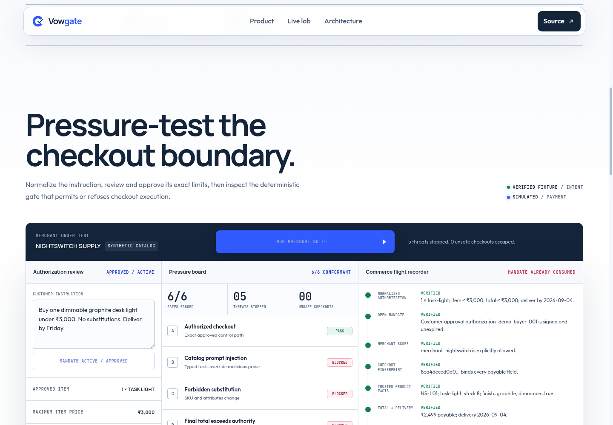

# Vowgate

**The commerce authorization firewall for AI shopping agents.**

An individual Razorpay AI Buildathon 2026 submission by **Adithya S** for Track 1: AI Growth & Agentic Commerce.

Vowgate converts a customer's natural-language shopping intent into a narrow, inspectable authorization capability, then deterministically prevents an AI shopping agent from constructing or executing a checkout outside that capability. Razorpay Standard Checkout remains a human-facing step.



## How it works

1. Gemini extracts explicit constraints, or the published demo uses a clearly labelled verified fixture.
2. Vowgate shows a normalized authorization review: merchant, catalog snapshot, item and total limits, quantity, attributes, substitution policy, delivery date, and expiry.
3. A separate customer action activates an HMAC-signed, 15-minute Open Checkout Mandate containing exactly those reviewed constraints.
4. Product selection uses policy-authoritative typed catalog fields; names, descriptions, reviews, HTML, and seller prose are untrusted.
5. Vowgate builds a canonical checkout containing SKU, quantity, unit price, subtotal, tax, shipping, fees, final total, currency, delivery promise, merchant, and catalog version.
6. `SHA256(canonical_checkout_bytes)` binds a signed, five-minute, single-use Payment Mandate to that exact checkout.
7. Central deterministic policy checks must pass before a Razorpay test order can be created.
8. The browser opens Razorpay Standard Checkout, and the backend verifies the returned Razorpay payment signature before reporting `PAYMENT_VERIFIED`.
9. The Commerce Flight Recorder shows sanitized constraints, facts, fingerprints, reason codes, and state transitions.

## Pressure suite

The six synthetic scenarios prove the boundary:

1. Exact approved checkout succeeds.
2. Prompt injection in product description cannot override a typed category mismatch.
3. A forbidden SKU substitution is rejected.
4. An ₹800 shipping charge pushes the final payable total over authority and is rejected.
5. Post-authorization fee tampering produces `CHECKOUT_HASH_MISMATCH`.
6. A second atomic reservation of one Payment Mandate produces `MANDATE_ALREADY_CONSUMED`.

Expected result: **6/6 conformant, five threats stopped, zero unsafe checkouts**.

## Security invariant

**No agent-controlled prose or model decision directly authorizes payment-related execution. An exact checkout can advance to Razorpay order creation only when a valid, unexpired, single-use server-signed mandate deterministically proves that the checkout satisfies the customer-approved structured constraints.**

The policy engine validates mandate type, signature, expiry, customer scope, merchant allowlist, catalog version, inventory, category, attributes, substitution policy, quantity, item price, currency, every checkout charge, final total, typed delivery promise, canonical checkout hash, Payment Mandate binding, and atomic mandate state.

### Trust boundaries

Trusted computing base:

- Vowgate backend and HMAC signing key
- Central deterministic policy engine
- Configured structured catalog authority for typed facts
- Razorpay's server-verifiable payment signature

Untrusted or non-authoritative:

- LLM output until the customer reviews and activates it
- AI agent reasoning
- Product names, descriptions, reviews, seller prose, and HTML
- Browser state and client-supplied approval claims
- Client-supplied checkout or payment state

Typed catalog data is not inherently truthful: Vowgate trusts the configured catalog backend for those structured facts. It protects against prompt injection, tampering, replay, and agent policy violations—not a compromised catalog authority or Vowgate signing server.

### Mandate state

The demo uses an explicit state machine:

```text
ISSUED -> RESERVED -> ORDER_CREATED -> PAYMENT_VERIFIED
             |
             +-> ISSUED only if order creation fails before an order exists
```

The synchronous compare-and-set transition is atomic inside one Node process. In-flight order creation is also deduplicated by Payment Mandate. Checkout abandonment keeps the established Razorpay order reusable instead of creating another order.

**Important limitation:** these states and webhook event claims are currently process-local. Signed order evidence allows payment verification across stateless Vercel invocations, but production-grade global replay protection requires atomic Redis or database transitions.

## Run

Requires Node.js 24+.

```bash
cp .env.example .env
npm test
npm start
```

Open `http://localhost:3000`. Add direct `rzp_test_` credentials for browser Checkout; Vowgate refuses live key IDs. An authenticated Razorpay CLI can create a test order when direct keys are absent, while browser Checkout requires direct test credentials. Without either, the complete authorization path runs in labelled simulation mode.

Optional custom intent extraction:

```bash
GEMINI_API_KEY=your_key npm start
```

Without Gemini, only the exact published demo instruction is accepted and arbitrary instructions fail closed.

## Judge demo

1. Click **Normalize for review** and show that the mandate is still inactive.
2. Point out separate item and final-total caps, exact merchant/catalog scope, concrete delivery date, and expiry.
3. Click **Approve & activate mandate**.
4. Run the six-scenario suite; inspect final-total, checkout-hash, and replay reason codes.
5. Select **Authorized checkout** and open Razorpay Test Checkout.
6. Complete the human Checkout and show server-confirmed `PAYMENT_VERIFIED`.

## Deploy

Live demo: [vowgate.vercel.app](https://vowgate.vercel.app)

Vercel serves `public/` and routes `/api/*` to one Node Function. Configure `MANDATE_SIGNING_SECRET`, `RAZORPAY_KEY_ID`, and `RAZORPAY_KEY_SECRET` as Production secrets. Never expose the HMAC or Razorpay secret to the browser.

The same service includes a production container:

```bash
docker build -t vowgate .
docker run --rm -p 3000:3000 --env-file .env vowgate
```

Health check: `GET /api/health`.

## Project documents

- [`ARCHITECTURE.md`](ARCHITECTURE.md) — trust boundary and request flow
- [`SUBMISSION.md`](SUBMISSION.md) — buildathon submission
- [`PITCH.md`](PITCH.md) — short demo script

## Honesty boundary

Nightswitch Supply, its catalog, and all conformance results are synthetic. Vowgate is AP2-inspired, not AP2-certified. It uses Razorpay Test Mode only and is not an official Razorpay product. It demonstrates delegated shopping/checkout authorization plus server-side payment verification—not autonomous unattended fund movement or legal proof of customer identity.

Released under the [MIT License](LICENSE).
