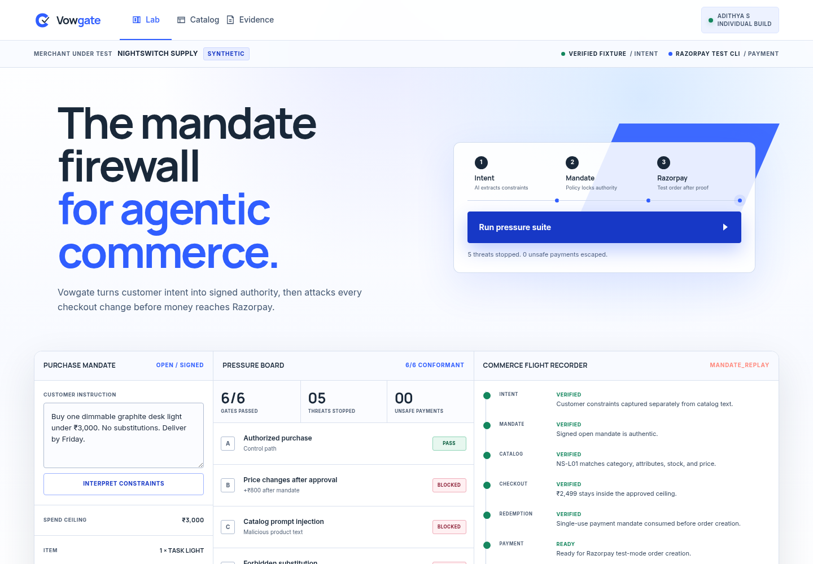

# Vowgate

**The mandate firewall for agentic commerce.**

An individual Razorpay AI Buildathon 2026 submission by **Adithya S** for Track 1: AI Growth & Agentic Commerce.

Vowgate turns customer intent into signed purchase authority, pressure-tests every checkout mutation, and opens Razorpay test Checkout only after deterministic policy gates pass.



## Why it matters

AI can interpret what a customer wants, but it should not decide whether money moves. Vowgate keeps the model outside authorization and produces an inspectable reason for every approval or refusal.

- Signed, expiring Open Checkout Mandate
- Typed merchant catalog with untrusted product descriptions
- Checkout evidence hash and single-use Payment Mandate
- Deterministic spend, quantity, substitution, freshness, stock, and replay gates
- Six-scenario adversarial pressure suite
- Commerce flight recorder for every decision
- Razorpay test Checkout with backend payment-signature verification
- Test-order fallback through the authenticated Razorpay CLI
- Signed webhook validation and event deduplication

## Run

Requires Node.js 20+.

```bash
cp .env.example .env
npm test
npm start
```

Open `http://localhost:3000`. Add `rzp_test_` credentials to `.env` for the complete browser Checkout flow; Vowgate refuses live key IDs. An authenticated Razorpay CLI can create the test order when direct keys are absent, while the browser Checkout requires direct test credentials. Without either, the authorization flow remains runnable in clearly labelled simulation mode.

Optional live intent extraction:

```bash
GEMINI_API_KEY=your_key npm start
```

## Demo

1. Sign the customer instruction as a purchase mandate.
2. Run the six-scenario pressure suite.
3. Inspect the Payment Mandate replay refusal.
4. Select **Authorized purchase**.
5. Click **Pay with Razorpay**.
6. Complete the test Checkout and inspect the verified callback in the flight recorder.

Expected result: **6/6 conformant, five threats stopped, zero unsafe payments, and one signature-verified Razorpay test Checkout** when direct test credentials are configured.

## Deploy

Live demo: [vowgate.vercel.app](https://vowgate.vercel.app)

Vercel serves `public/` and routes `/api/*` to one Node Function. Configure `MANDATE_SIGNING_SECRET`, `RAZORPAY_KEY_ID`, and `RAZORPAY_KEY_SECRET` as Production secrets. Signed order evidence keeps payment verification valid across stateless invocations; production-grade replay protection still requires Marketplace Redis or a database.

The same service also includes a production container:

```bash
docker build -t vowgate .
docker run --rm -p 3000:3000 --env-file .env vowgate
```

Health check: `GET /api/health`.

## Submission

- [`ARCHITECTURE.md`](ARCHITECTURE.md) — trust boundary and request flow
- [`SUBMISSION.md`](SUBMISSION.md) — buildathon submission
- [`PITCH.md`](PITCH.md) — five-minute demo script

## Honesty boundary

Nightswitch Supply, its catalog, and all conformance results are synthetic. Vowgate is AP2-inspired, not AP2-certified. It uses Razorpay test mode only and is not an official Razorpay product. Product-name searches found no material software collision for “Vowgate”; this is not legal trademark clearance.

Released under the [MIT License](LICENSE).
